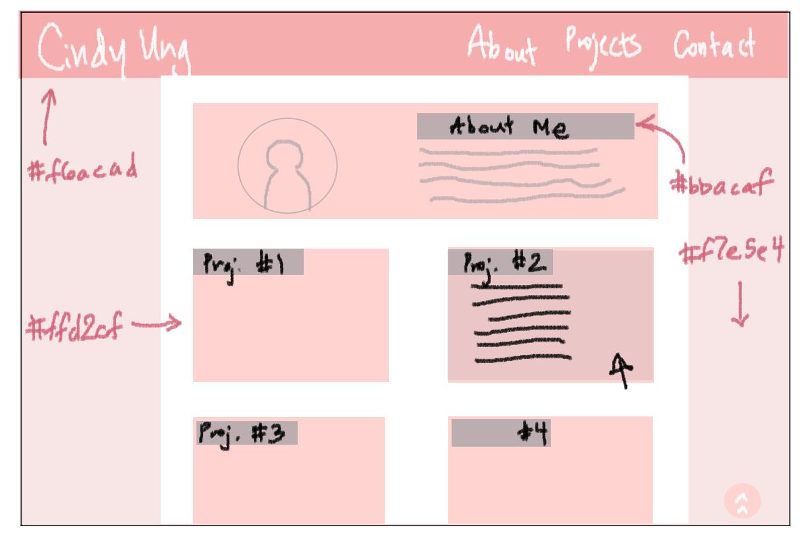
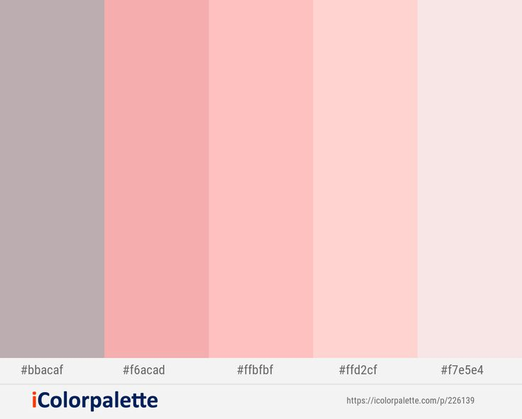

# My Personal Portfolio

## About

## Link

## Process

I created a brief wireframe using Clip Studio Paint. I wanted to get started on this project as soon as I possibly could, so I decided to draw it by hand instead of using a wireframing tool (though I would love to use it in the future!). This is the wireframe I roughly created using the color scheme and a rough layout of how I wanted my portfolio to look:

## Inspiration / Resources

When researching a color palette, I initially wanted to incorporate some sort of peach and aqua color as contrast, but the shades were a bit bright for my liking and didn't clash well at first. But after searching on Google, I found the Pink Swan palette created by icolorpalette on Pinterest:

https://www.pinterest.com/pin/pink-swan-wewak-your-pink-peach-schnapps-pot-pourri-color-scheme--764767580450190700/

Below are the following links I've used to help me out with CSS solutions, or just for general help and inspiration:

Google Fonts: https://fonts.google.com/

How to make images responsive: https://www.freecodecamp.org/news/css-responsive-image-tutorial/

How to make links open up in a new tab: https://stackoverflow.com/questions/27915253/how-to-open-links-in-a-new-tab-window-using-css

How to center a background image using CSS: https://stackoverflow.com/questions/2643305/centering-a-background-image-using-css